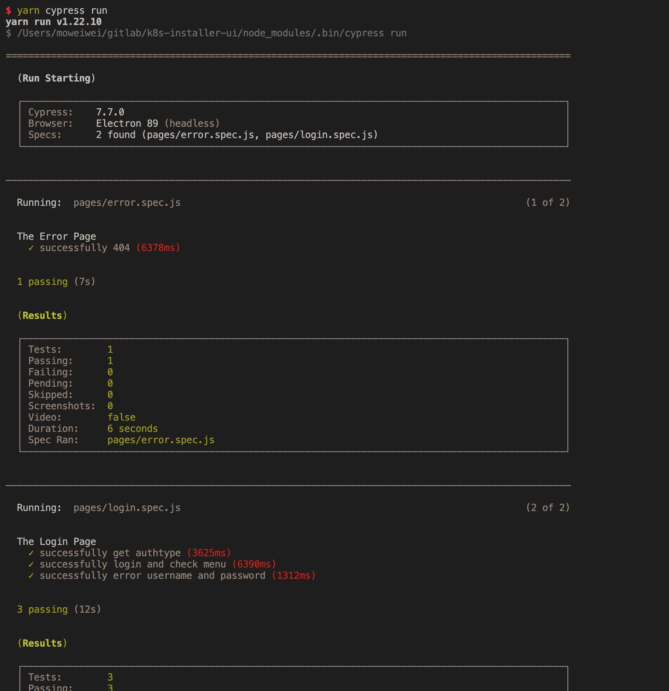
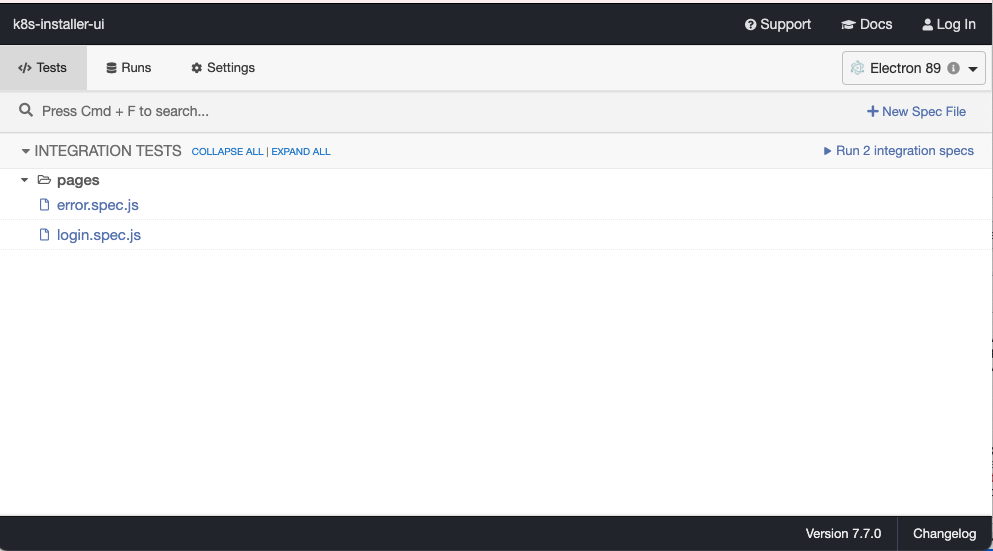
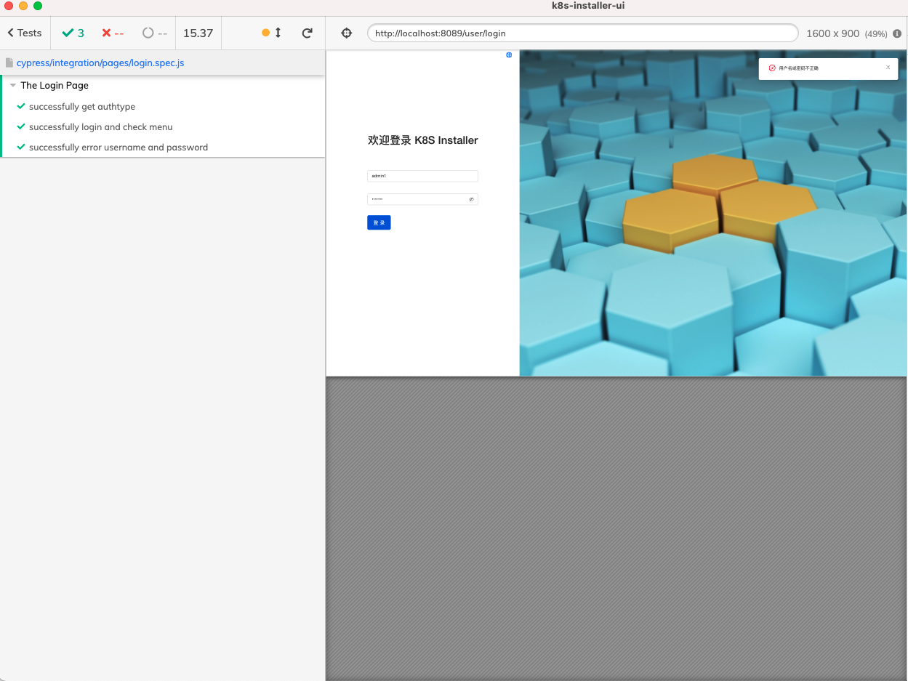
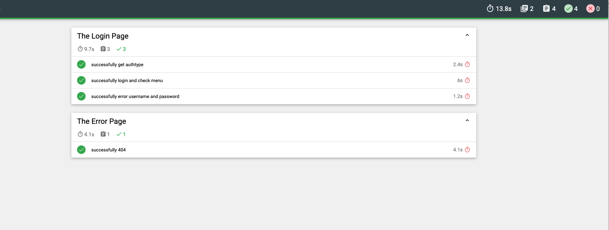
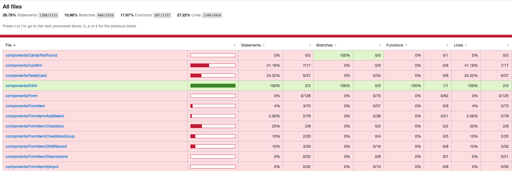
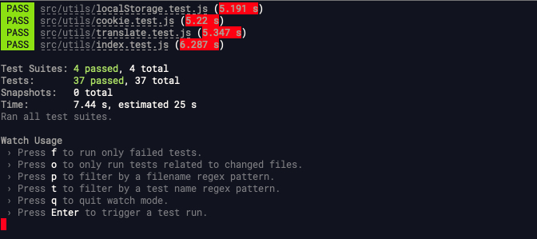
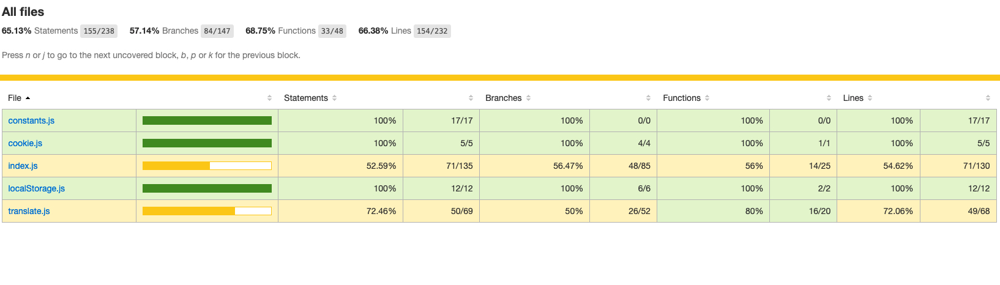

# 前端 E2E 测试和单元测试方案

我们提供了两种类型的测试

- E2E 测试
  - 侧重于功能点测试
  - 能提供代码覆盖率数据
  - 使用 `Cypress` 框架，具体语法参考： [Cypress](https://docs.cypress.io/api/cypress-api/custom-commands)
  - 测试结果保存到便于预览的静态页面中
- 单元测试
  - 侧重于基础函数测试
  - 使用 `Jest` 框架, 参考：[Jest](https://jestjs.io/docs/getting-started)

## E2E 测试

### 搭建 E2E 测试环境

- node.js 环境

  - 中要求：`"node.js": ">=12"`
  - 验证 node.js 版本

    ```shell
    node -v
    ```

- linux 环境安装 cypress 系统依赖

  - Ubuntu/Debian

    ```sh
    apt-get install libgtk2.0-0 libgtk-3-0 libgbm-dev libnotify-dev libgconf-2-4 libnss3 libxss1 libasound2 libxtst6 xauth xvfb
    ```

  - CentOS

    ```sh
    yum install -y xorg-x11-server-Xvfb gtk2-devel gtk3-devel libnotify-devel GConf2 nss libXScrnSaver alsa-lib
    ```

- yarn

  - 安装 yarn

    ```shell
    npm install -g yarn
    ```

- 安装依赖包

  - 在项目根目录下执行，即`package.json`同级，需要耐心等待安装完成

    ```shell
    yarn install
    ```

- 启动项目

```shell
yarn start
```

备注：项目运行地址需要和 `cypress/config/config.yaml 中 baseUrl` 相同。

- 调整访问路径、账号等信息

  - E2E 的配置文件存放于 cypress/config/config.yaml，在其中配置了

    - baseUrl，测试访问路径
    - env，环境变量
    - testFiles，测试文件列表

  - 可以通过直接修改 config.yaml 中的相应数值完成配置变更
  - 也可以通过 local_config.yaml 完成配置变更
  - 复制 cypress/config/config.yaml 到 cypress/config/local_config.yaml 中
  - 修改 local_config.yaml 中的相应变量
  - 对于变量的取值，优先级为：local_config.yaml > config.yaml

### 命令行运行 E2E

```shell
yarn test:e2e
```



### GUI 运行 E2E

```shell
yarn test:e2e:open
```

Cypress 提供了 GUI





### E2E 测试结果

测试运行结束后，访问`cypress/report/merge-report.html`即可查看



### E2E 代码覆盖率测试结果

> 注意：代码覆盖率，需要 E2E 访问的`baseUrl`对应的前端包，是具有可检测代码覆盖率版本的`dist`包

打包前端项目

```shell
yarn run build:test
```

本地使用 nginx 容器将上述打包生成的文件运行。

```shell
docker run --rm -d -p 8089:80 --name kubeclipper-console-test -v ~/${distPath}:/usr/share/nginx/html -v ~/${nginx_conf_path}:/etc/nginx/conf.d/default.conf nginx
```

distPath 为打包生成的 dist 文件夹路径。 注： 映射端口与 baseUrl 中保持一致。

测试项目启动后，以下命令跑 e2e 测试。

```shell
yarn test:e2e
```

测试运行结束后自动生成覆盖率报告，访问`coverage/lcov-report/index.html`即可查看



以下，给出启动容器的 nginx default.conf 配置

```nginx
server {
    listen       80;
    listen  [::]:80;
    server_name  localhost;
    root   /usr/share/nginx/html;
    index index.html;
    location / {
        root   /usr/share/nginx/html;
        try_files $uri $uri/ /index.html;
    }

    location /api/ {
      proxy_pass <backend_address>/api/;
    }


    error_page   500 502 503 504  /50x.html;
    location = /50x.html {
        root   /usr/share/nginx/html;
    }
}
```

## 单元测试

> 详细配置在 根目录下 `jest.config.js`, 其他配置可参考官网文档

### 单元测试使用

终端运行 `yarn run test:unit`, 会执行目录下测试文件，并进入监听模式 

以下命令， 用于监听代码改动时，执行测试

```ts
Watch Usage
// 只运行 测试出错的测试
- Press f to run only failed tests
// 只运行和改变文件相关的测试 （需要项目下拥有git 用于检测项目变动）
- Press o to only run tests related to changed files
// 只运行项目下 对于 xx文件(正则)的测试
- Press p to filter by a filename regex pattern
// 只运行代码中 对于 xx(正则)的测试
- Press t to filter by a test name regex pattern
// 退出监听
- press q to quit watch mode
- press Enter to trigger a test run
```

### 单元测试覆盖率

终端运行 `yarn run test:unit:coverage`, 会匹配项目下

- tests 文件夹
- \*.{spec,test}.{js,jsx,ts,tsx} 文件

执行单元测试 并在根目录下生成`unitCoverage`覆盖率报告，访问`coverage/lcov-report/index.html`即可查看


